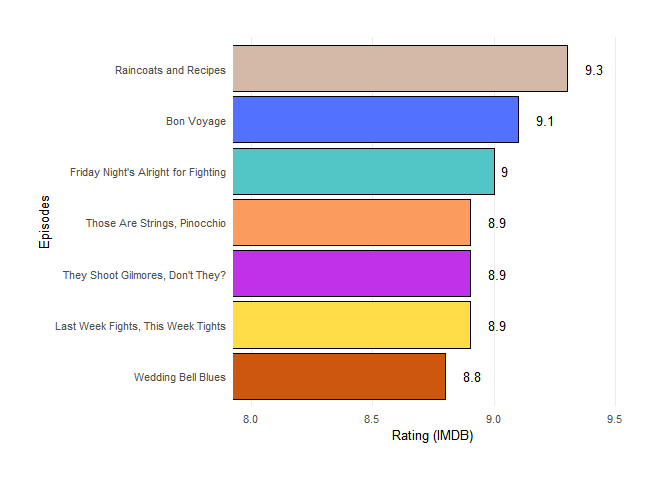

<!-- README.md is generated from README.Rmd. Please edit that file -->

# gilmoregirls

<!-- badges: start -->
<!-- badges: end -->

The goal of gilmoregirls is to provide the complete script transcription
of the Gilmore Girls (*work in progress*) and information about the
episodes of the TV Show.

## Installation

You can install the development version of gilmoregirls from
[GitHub](https://github.com/) with:

``` r
# install.packages("devtools")
devtools::install_github("lgiselebock/gilmoregirls")
```

## Example

The `gilmoregirls` package comes with one dataset, that contains the
informations about all the episodes in the show.

``` r
library(gilmoregirls)

dplyr::glimpse(gilmoregirls_info)
#> Rows: 153
#> Columns: 10
#> $ index             <int> 1, 2, 3, 4, 5, 6, 7, 8, 9, 10, 11, 12, 13, 14, 15, 1…
#> $ season            <int> 1, 1, 1, 1, 1, 1, 1, 1, 1, 1, 1, 1, 1, 1, 1, 1, 1, 1…
#> $ episode           <int> 1, 2, 3, 4, 5, 6, 7, 8, 9, 10, 11, 12, 13, 14, 15, 1…
#> $ title             <chr> "Pilot", "The Lorelais' First Day at Chilton", "Kill…
#> $ directed_by       <chr> "Lesli Linka Glatter", "Arlene Sanford", "Adam Nimoy…
#> $ written_by        <chr> "Amy Sherman-Palladino", "Amy Sherman-Palladino", "J…
#> $ air_date          <chr> "October 5, 2000 ", "October 12, 2000 ", "October 19…
#> $ us_views_millions <dbl> 5.03, 3.40, 2.89, 3.93, 3.88, 3.73, 3.45, 3.80, 3.62…
#> $ imdb_rating       <dbl> 8.1, 8.0, 7.8, 7.9, 7.8, 8.5, 8.4, 8.1, 8.7, 8.3, 7.…
#> $ description       <chr> "Rory is accepted into the elite Chilton prep school…
```

### Audience (in millions) in the USA

``` r

gilmoregirls_info %>%
  dplyr::mutate(season = as.factor(season)) %>%
  ggplot2::ggplot() +
  ggplot2::aes(x = index,
               y = us_views_millions,
               fill = season,
               width = 0.5) +
  ggplot2::geom_col() +
  ggplot2::labs(x = "Episodes",
                y = "Audience (millions) in the USA",
                fill = "Season") +
  ggplot2::scale_x_continuous(breaks = seq(0, 153, 20)) +
  ggplot2::scale_y_continuous(limits = c(0, 8), breaks = seq(0, 8, 2)) +
  ggplot2::scale_fill_manual(values = c(
    "#d4b9a9",
    "#5271ff",
    "#52c5c7",
    "#c131e8",
    "#fc9b5e",
    "#ffdd49",
    "#cd570f"
  )) +
  ggplot2::theme_minimal() +
  ggplot2::theme(
    panel.grid.major.x = ggplot2::element_blank(),
    panel.grid.minor = ggplot2::element_blank(),
    legend.position = c(1.06, 1.06),
    legend.justification = c("right", "top"),
    legend.box.just = "right",
    plot.margin = ggplot2::unit(c(1, 1, 1, 1), "cm"),
    text = ggplot2::element_text(size = 10)
  )
```


### Top 7 episodes with best IMDB ratings

``` r
gilmoregirls_info %>%
  dplyr::arrange(desc(imdb_rating)) %>%
  dplyr::slice_head(n = 7) %>%
  ggplot2::ggplot() +
  ggplot2::aes(x = imdb_rating, y = reorder(title, +imdb_rating)) +
  ggplot2::geom_col(
    color = "black",
    fill = c(
      "#d4b9a9",
      "#5271ff",
      "#52c5c7",
      "#c131e8",
      "#fc9b5e",
      "#ffdd49",
      "#cd570f"
    )
  ) +
  ggplot2::geom_text(ggplot2::aes(label = imdb_rating,
                                  hjust = -1),
                     size = 3.5) +
  ggplot2::labs(x = "Rating (IMDB)", y = "Episodes") +
  ggplot2::coord_cartesian(xlim = c(8, 9.5)) +
  ggplot2::scale_x_continuous(breaks = seq(8, 9.5, .5)) +
  ggplot2::theme_minimal() +
  ggplot2::theme(
    panel.grid.minor = ggplot2::element_blank(),
    panel.grid.major.y = ggplot2::element_blank(),
    plot.margin = ggplot2::unit(c(1, 1, 1, 1), "cm"),
    text = ggplot2::element_text(size = 10)
  )
```


